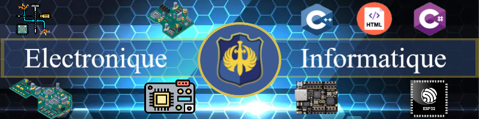

<h1 align="center"> Bonjour 👋 Maintenance du Profil en cours </h1>  

<h1 align="center"> Bonjour 👋 Je suis Jérémy Clémente </h1>

 Actuellement étudiant en GEII à l'université Nancy Brabois. Je suis aussi passioné par l'électronique ainsi que l'informatique embarqué plus précisement les cartes arduino et ESP32. Je fait aussi de l'informatique C# sur visual studio ainsi que un peu d'html sur visual studio code. Ici vous pouvez retrouvez mes différents projet que je publie en open source. Mes projets sont ce que je réalise en passe temps 

<h1 align="center"> Github Stats </h1>

  
  

<!--
**J3R5/J3R5** is a ✨ _special_ ✨ repository because its `README.md` (this file) appears on your GitHub profile.

Here are some ideas to get you started: [[height="275" weight="1800"](https://i.gifer.com/24Qk.gif)](https://i.gifer.com/24Qk.mp4)
👋 
- 🔭 I’m currently working on ...
- 🌱 I’m currently learning ...
- 💬 Ask me about ...
- ⚡ Fun fact: 
-->
